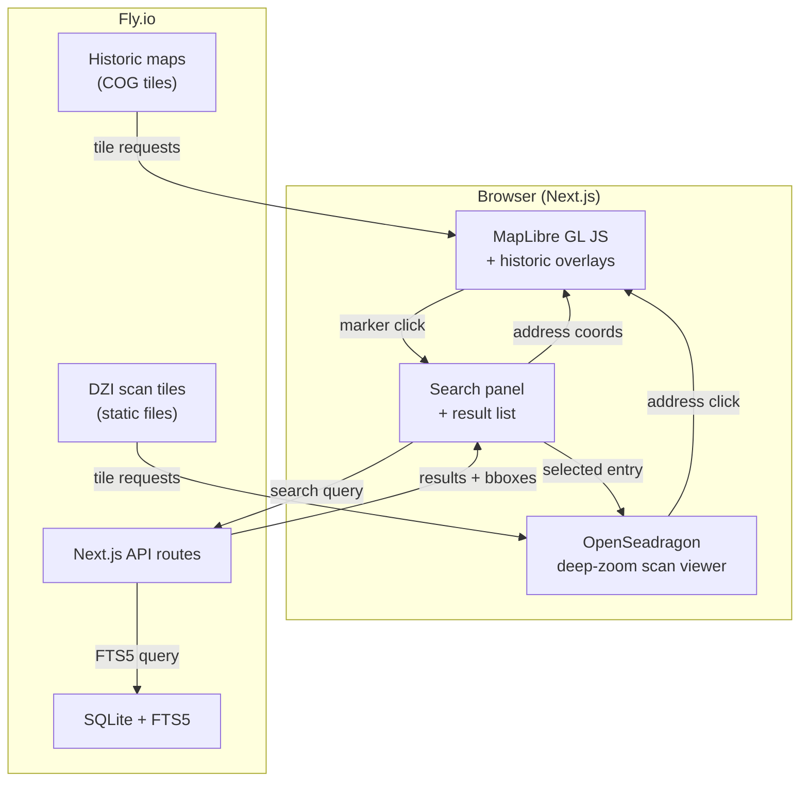

# Part 2: Interactive Website — 1926 Groningen Address Book Explorer

## Goal

Build a map-centric interactive web application that lets anyone explore the 1926 Groningen address book. Users can search by name/street/occupation, view highlighted results on the original scanned pages, and see every address plotted on a map with toggle-able historic overlays.

## Architecture Overview



## Tech Stack

| Component | Technology | Why |
|-----------|-----------|-----|
| Framework | **Next.js** (App Router) | SSR, API routes, good i18n support |
| Map | **MapLibre GL JS** | GPU-accelerated, free, great raster overlay support |
| Scan viewer | **OpenSeadragon** | Industry standard for deep-zoom image viewing |
| Search | **SQLite + FTS5** | Zero-infrastructure full-text search, perfect for ~50K entries |
| i18n | **next-intl** | Mature, App Router compatible, NL/EN |
| Styling | **Vanilla CSS** (CSS Modules) | Full control, dark mode via CSS variables |
| Historic maps | **Cloud Optimized GeoTIFF** (COG) | Stream directly, no tile server needed |
| Geocoding | **PDOK Locatieserver** | Free, official Dutch geocoding API |
| Image tiling | **libvips** (`vips dzsave`) | Fast DZI tile generation for OpenSeadragon |
| Hosting | **Fly.io** | Persistent volumes for SQLite + scan tiles |

---

## Data Preprocessing (one-time, before deployment)

### 1. Image Tiling (DZI generation)

Convert 838 JPEG scans into Deep Zoom Image (DZI) tiles for OpenSeadragon.

```bash
# Using libvips (fast, handles batch well)
for f in scans/*.jpg; do
    name=$(basename "$f" .jpg)
    vips dzsave "$f" "tiles/$name" --suffix .webp --tile-size 256
done
```

**Output per scan**: one `.dzi` XML file + a `_files/` directory with zoom-level tiles.
**Estimated total size**: ~1.5–2 GB (WebP tiles are smaller than JPEG originals).

### 2. PDOK Geocoding (batch)

Geocode all unique addresses from `address_index.json` to lat/lng coordinates.

```python
# Batch geocoding script (runs once)
import requests, json, time

PDOK_URL = "https://api.pdok.nl/bzk/locatieserver/search/v3_1/free"

def geocode(address: str) -> dict | None:
    """Geocode a Dutch address via PDOK Locatieserver."""
    resp = requests.get(PDOK_URL, params={
        "q": f"{address}, Groningen",
        "fq": "type:adres",
        "rows": 1,
    })
    docs = resp.json().get("response", {}).get("docs", [])
    if docs:
        # PDOK returns centroide_ll as "POINT(lng lat)"
        point = docs[0].get("centroide_ll", "")
        if point:
            lng, lat = point.replace("POINT(", "").replace(")", "").split()
            return {"lat": float(lat), "lng": float(lng), "score": docs[0].get("score")}
    return None

# Load addresses, geocode, save results
with open("output/combined/address_index.json") as f:
    addresses = json.load(f)

geocoded = {}
for addr in addresses:
    result = geocode(addr)
    if result:
        geocoded[addr] = result
    time.sleep(0.1)  # Be polite to the API

with open("geocoded_addresses.json", "w") as f:
    json.dump(geocoded, f, indent=2)
```

**Expected coverage**: ~80%+ of addresses should geocode successfully via PDOK.
**Failed addresses**: Will need manual mapping or concordance data later.

### 3. SQLite Database Import

Import the pipeline's JSON output into SQLite with FTS5 for full-text search.

```sql
-- Core tables
CREATE TABLE pages (
    id INTEGER PRIMARY KEY,
    scan_file TEXT UNIQUE,
    page_number INTEGER,
    section TEXT,
    width INTEGER,
    height INTEGER
);

CREATE TABLE entries (
    id INTEGER PRIMARY KEY,
    page_id INTEGER REFERENCES pages(id),
    name TEXT,
    initials TEXT,
    name_prefix TEXT,
    name_prefix_expanded TEXT,
    occupation TEXT,
    occupation_expanded TEXT,
    address_street TEXT,
    address_street_expanded TEXT,
    address_number TEXT,
    address_full TEXT,
    phone TEXT,
    entry_bbox TEXT,       -- JSON [x1,y1,x2,y2]
    name_bbox TEXT,        -- JSON [x1,y1,x2,y2]
    address_bbox TEXT,     -- JSON [x1,y1,x2,y2]
    word_ids TEXT,         -- JSON array
    name_word_ids TEXT,
    address_word_ids TEXT,
    lat REAL,              -- From PDOK geocoding
    lng REAL,
    searchable_text TEXT
);

-- Full-text search index
CREATE VIRTUAL TABLE entries_fts USING fts5(
    name,
    initials,
    name_prefix_expanded,
    occupation_expanded,
    address_street_expanded,
    address_number,
    searchable_text,
    content='entries',
    content_rowid='id'
);

-- Spatial index for map queries
CREATE INDEX idx_entries_coords ON entries(lat, lng) WHERE lat IS NOT NULL;

-- Cross-references
CREATE TABLE cross_references (
    id INTEGER PRIMARY KEY,
    source_entry_id INTEGER REFERENCES entries(id),
    source_page_number INTEGER,
    target_type TEXT,
    target_page_number INTEGER
);
```

### 4. Historic Map Conversion

Convert georeferenced GeoTIFF/GeoJP2 maps to Cloud Optimized GeoTIFF.

```bash
# Convert to COG (using GDAL)
gdal_translate -of COG \
    -co COMPRESS=JPEG \
    -co QUALITY=80 \
    -co TILING_SCHEME=GoogleMapsCompatible \
    input_historic_map.tif \
    historic_map_1926.cog.tif
```

COG files can be served as static files — MapLibre fetches only the tiles it needs via HTTP range requests.

---

## Project Structure

```
groningen-adresboek-1926-web/
├── app/
│   ├── [locale]/
│   │   ├── layout.tsx              # Root layout with i18n provider
│   │   ├── page.tsx                # Main page (map + panels)
│   │   └── globals.css             # Global styles, CSS variables
│   ├── api/
│   │   ├── search/route.ts         # Full-text search endpoint
│   │   ├── page/[scan]/route.ts    # Get page data (entries, words, bboxes)
│   │   ├── address/[id]/route.ts   # Get entries at an address
│   │   └── markers/route.ts        # Get map markers (clustered)
│   └── layout.tsx                  # Root (redirect to locale)
├── components/
│   ├── Map/
│   │   ├── MapView.tsx             # MapLibre GL map component
│   │   ├── MarkerLayer.tsx         # Address markers with clustering
│   │   ├── HistoricOverlay.tsx     # Historic map overlay controls
│   │   └── AddressPopup.tsx        # Popup when clicking a marker
│   ├── Search/
│   │   ├── SearchPanel.tsx         # Collapsible search panel
│   │   ├── SearchInput.tsx         # Search input with debounce
│   │   ├── SearchFilters.tsx       # Filter toggles (name/street/occ)
│   │   └── ResultCard.tsx          # Individual search result
│   ├── Scan/
│   │   ├── ScanPanel.tsx           # Collapsible scan viewer panel
│   │   ├── ScanViewer.tsx          # OpenSeadragon wrapper
│   │   ├── HighlightOverlay.tsx    # Word/entry highlighting overlays
│   │   └── PageNavigation.tsx      # Prev/next page controls
│   ├── Welcome/
│   │   └── WelcomePopup.tsx        # First-visit explanatory popup
│   └── LanguageSwitcher.tsx        # NL/EN toggle
├── lib/
│   ├── db.ts                       # SQLite connection + query helpers
│   ├── search.ts                   # FTS5 search logic
│   ├── geocode.ts                  # PDOK geocoding utilities
│   └── i18n.ts                     # next-intl configuration
├── messages/
│   ├── nl.json                     # Dutch UI translations
│   └── en.json                     # English UI translations
├── public/
│   ├── tiles/                      # DZI scan tiles (or served from volume)
│   ├── maps/                       # COG historic map files
│   └── openseadragon/              # OSD navigation icons
├── scripts/
│   ├── import-data.ts              # Import pipeline JSON → SQLite
│   ├── geocode-addresses.ts        # Batch PDOK geocoding
│   └── generate-tiles.sh           # DZI tile generation script
├── data/
│   └── adresboek.sqlite            # SQLite database (generated)
├── fly.toml                        # Fly.io deployment config
├── Dockerfile                      # Container for Fly.io
├── next.config.js
├── package.json
└── tsconfig.json
```

---

## API Routes

### `GET /api/search?q=bakker&filter=name&page=1&limit=20`

Full-text search across entries.

```json
{
  "total": 247,
  "results": [
    {
      "id": 4521,
      "name": "Bakker",
      "initials": "H.",
      "occupation_expanded": "Broodlooper",
      "address_full": "De Hoogte 14",
      "scan_file": "0003_000138_0156.jpg",
      "page_number": 154,
      "lat": 53.2194,
      "lng": 6.5665,
      "entry_bbox": [45, 227, 710, 251]
    }
  ]
}
```

### `GET /api/page/0003_000138_0156`

Get all data for a specific scan page (for the viewer).

```json
{
  "scan_file": "0003_000138_0156.jpg",
  "page_number": 154,
  "section": "name_register",
  "dimensions": { "width": 2480, "height": 3508 },
  "words": ["..."],
  "entries": ["..."]
}
```

### `GET /api/markers?bounds=53.20,6.54,53.23,6.59&zoom=15`

Get address markers within map bounds (for clustering).

```json
{
  "markers": [
    {
      "lat": 53.2194,
      "lng": 6.5665,
      "address": "De Hoogte 14",
      "entry_count": 1,
      "entries": [{ "id": 4521, "name": "Bakker, H.", "occupation": "Broodlooper" }]
    }
  ]
}
```

### `GET /api/address/:id`

Get all entries at a specific address.

---

## Fly.io Deployment

### `fly.toml`

```toml
app = "groningen-adresboek-1926"
primary_region = "ams"  # Amsterdam — closest to Groningen

[build]
  dockerfile = "Dockerfile"

[mounts]
  source = "app_data"
  destination = "/data"

[http_service]
  internal_port = 3000
  force_https = true

[[vm]]
  size = "shared-cpu-1x"
  memory = "512mb"
```

### Volume layout (`/data/`)

```
/data/
├── adresboek.sqlite        # SQLite database (FTS5)
├── tiles/                  # DZI scan tiles (~2 GB)
│   ├── 0003_000138_0001.dzi
│   ├── 0003_000138_0001_files/
│   └── ...
└── maps/                   # Historic map COG files
    ├── groningen_1926_detail.cog.tif
    └── groningen_1926_overview.cog.tif
```

### Estimated Fly.io costs

| Resource | Spec | Cost/month |
|----------|------|-----------|
| Machine | shared-cpu-1x, 512 MB | ~$3 |
| Volume | 5 GB (SQLite + tiles + maps) | ~$0.75 |
| Bandwidth | ~10–50 GB/month (estimated) | Included in free tier |
| **Total** | | **~$4/month** |

---

## Key Implementation Details

### Historic Map Overlays

Using Cloud Optimized GeoTIFF (COG) via `@geomatico/maplibre-cog-protocol`:

```tsx
// MapView.tsx
import { Protocol } from '@geomatico/maplibre-cog-protocol';
import maplibregl from 'maplibre-gl';

// Register COG protocol once
maplibregl.addProtocol('cog', new Protocol().tile);

// Add historic map layer
map.addSource('historic-1926', {
    type: 'raster',
    url: 'cog:///data/maps/groningen_1926.cog.tif',
    tileSize: 256,
});
map.addLayer({
    id: 'historic-overlay',
    type: 'raster',
    source: 'historic-1926',
    paint: { 'raster-opacity': overlayOpacity },
});
```

### OpenSeadragon Highlighting

Overlay SVG rectangles on the deep-zoom viewer for word/entry highlights:

```tsx
// HighlightOverlay.tsx
const addHighlight = (viewer, bbox, type) => {
    const [x1, y1, x2, y2] = bbox;
    const rect = document.createElementNS("http://www.w3.org/2000/svg", "rect");
    rect.setAttribute("x", x1);
    rect.setAttribute("y", y1);
    rect.setAttribute("width", x2 - x1);
    rect.setAttribute("height", y2 - y1);
    rect.setAttribute("class", type === 'word' ? 'highlight-word' : 'highlight-entry');
    viewer.svgOverlay().node().appendChild(rect);
};
```

### i18n Setup

```
messages/nl.json:  { "search.placeholder": "Zoek op naam, straat of beroep..." }
messages/en.json:  { "search.placeholder": "Search by name, street, or occupation..." }
```

All UI text uses `useTranslations()`. Source data (names, streets) is always in Dutch — it's historical data and not translated.

---

## Execution Plan Summary

| Step | What | Time estimate |
|---|---|---|
| 1. Project scaffolding | Next.js + deps + Fly.io setup | 2–3 hours |
| 2. Data preprocessing | Tile generation + PDOK geocoding + SQLite import | 2–3 hours |
| 3. Map component | MapLibre GL + markers + clustering + popups | 3–4 hours |
| 4. Historic overlay | COG integration + opacity slider + layer switcher | 2–3 hours |
| 5. Search panel | Search input + FTS5 API + results list | 2–3 hours |
| 6. Scan viewer | OpenSeadragon + highlighting + page navigation | 3–4 hours |
| 7. Bidirectional nav | Search→scan→map→search flows | 2–3 hours |
| 8. i18n | next-intl setup + NL/EN translations | 1–2 hours |
| 9. Welcome popup | Explanatory first-visit popup | 1 hour |
| 10. Polish and responsive | Mobile layout, animations, edge cases | 3–4 hours |
| 11. Deploy to Fly.io | Dockerfile, volumes, domain setup | 1–2 hours |
| **Total** | | **~25–35 hours** |

---

## Open Questions

> [!NOTE]
> 1. **Historic maps**: How many different map layers do you have? Just one overview, or multiple detail levels? What's the approximate file size? This affects storage planning.
>
> 2. **Custom domain**: Do you want this on a custom domain (e.g., `adresboek.groningen.nl` or something under your own domain)?
>
> 3. **Page browsing**: Should users be able to browse pages sequentially (like flipping through the book), or only arrive at pages through search/map interactions?
>
> 4. **Data updates**: Once deployed, do you expect to rerun the pipeline and update the data, or is this a one-time import? This affects whether we need an automated import pipeline.
>
> 5. **Analytics**: Do you want basic usage analytics (page views, popular searches)?

---

## Reference Documents

| Document | Purpose |
|----------|---------|
| [ui.md](file:///Users/lieuwejongsma/projects/groningen-adresboek-1926/ui.md) | Detailed UI/UX design with layout diagrams, interaction flows, color palette |
| [Part 1 implementation plan](file:///Users/lieuwejongsma/.gemini/antigravity/brain/79149398-39ec-41a5-9a7d-76d8f489f0b4/implementation_plan.md) | Data extraction pipeline plan |
